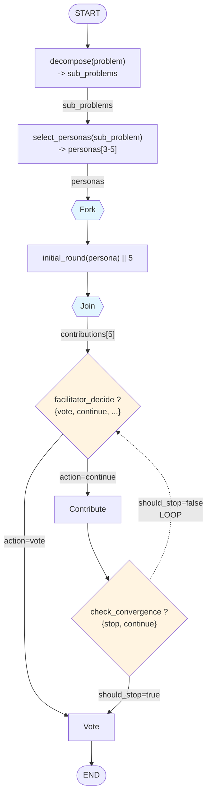

# Board of One: Flow Design Language v2.0 (REVISED)

**Version**: 2.0.0 (Critical Revision)
**Created**: 2025-01-22
**Changes**: Eliminated ambiguity, improved explicitness, reduced complexity

---

## Design Principles

1. **Explicitness over Brevity** - Clear is better than short
2. **One Way to Do It** - Reduce cognitive load
3. **1:1 YAML Mapping** - Notation directly reflects config structure
4. **Execution Order Visible** - Reader knows exact flow path
5. **Data Flow Explicit** - Show what data moves where

---

## Core Notation Elements

### 1. Nodes (Execution Units)

**Syntax**: `NodeName(inputs) -> outputs`

**Types**:
- `TaskNode(in)` - Single execution unit
- `ParallelNode(in) || N` - N parallel instances
- `RouterNode(in) ?` - Decision point
- `AggregateNode(in[]) ∑` - Collects multiple inputs

**Examples**:
```
decompose(problem) -> sub_problems
select_personas(sub_problem) -> personas[3-5]
initial_round(personas) || 5 -> contributions[5]
facilitator_decide(contributions) ? -> decision
```

---

### 2. Edges (Flow Control)

**Syntax**: Explicit arrows with labels

**Types**:
```
A -> B              Linear flow (unconditional)
A ->|label| B       Labeled flow (for clarity)
A ? {               Decision point with explicit targets
  case1: B,
  case2: C,
  default: D
}
A ->loop-> B        Loop back (explicit loop keyword)
A || N -> join -> B  Parallel with explicit join
```

**Examples**:
```
decompose -> context_collection
facilitator_decide ? {
  action=vote: vote,
  action=moderator: moderator_intervene,
  action=continue: persona_contribute,
  default: END
}
persona_contribute ->loop-> facilitator_decide
```

---

### 3. Guards (Conditions)

**Syntax**: `NodeName ? (condition)` or inline `->|(condition)| NodeName`

**Always explicit about**:
- What's being tested
- Where the test happens
- What happens if true/false

**Examples**:
```
# Guard on node
check_convergence ? (should_stop=true) -> vote
check_convergence ? (should_stop=false) ->loop-> facilitator_decide

# Guard on edge
synthesize ->|(has_more_subproblems)| next_subproblem
synthesize ->|(all_complete)| meta_synthesis
```

---

### 4. Data Flow (Explicit Inputs/Outputs)

**Syntax**: `NodeName(inputs) -> outputs`

**Always show**:
- What data goes IN
- What data comes OUT
- Cardinality (scalar, array, optional)

**Examples**:
```
decompose(problem) -> sub_problems[1-5]
select_personas(sub_problem) -> personas[3-5]
initial_round(personas[N]) || N -> contributions[N]
vote(personas[N]) || N -> recommendations[N]
synthesize(recommendations[N]) -> synthesis
```

---

### 5. Loops (Explicit Return Paths)

**Problem with v1**: `⭯` didn't show WHERE it loops back to

**v2 Solution**: Explicit loop arrows with labels

**Syntax**:
```
A -> B -> C ? {
  continue: ->loop(label)-> A,
  stop: D
}
```

**Example**:
```
# Multi-round discussion loop
LOOP_START: facilitator_decide(contributions) ? {
  action=vote: vote,
  action=continue: persona_contribute
}

persona_contribute(decision) -> contribution

check_convergence(contribution) ? {
  should_stop=false: ->loop(LOOP_START)-> facilitator_decide,
  should_stop=true: vote
}
```

**Visual indicator**: `->loop(LABEL)->` makes loop explicit

---

### 6. Parallel Execution (Explicit Join)

**Problem with v1**: `||[×5]` didn't show join point

**v2 Solution**: Explicit join syntax

**Syntax**:
```
fork -> Node || N -> join -> next
```

**Example**:
```
select_personas(sub_problem) -> personas[3-5]

# Parallel execution with explicit join
fork -> initial_round(persona) || 5 -> join -> contributions[5]

contributions[5] -> facilitator_decide(contributions)
```

---

### 7. Decision Points (Explicit Outcomes)

**Problem with v1**: `◇ {vote, continue}` looked like both execute

**v2 Solution**: Question mark `?` with explicit case structure

**Syntax**:
```
RouterNode(inputs) ? {
  case1: TargetA,
  case2: TargetB,
  default: TargetC
}
```

**Example**:
```
facilitator_decide(contributions, round) ? {
  action=vote: vote,
  action=moderator: moderator_intervene,
  action=continue: persona_contribute,
  action=clarify: clarification,
  default: END
}
```

---

### 8. State Tracking (Before/After Clear)

**Problem with v1**: `{round: +1}` placement ambiguous

**v2 Solution**: `before:` and `after:` blocks

**Syntax**:
```
NodeName(inputs)
  before: {state_updates}
  after: {state_updates}
  -> outputs
```

**Example**:
```
persona_contribute(context, persona_code)
  before: {
    metrics.phase_costs: start_tracking("persona_contribution"),
    current_speaker: persona_code
  }
  after: {
    round_number: +1,
    contributions: append(new_contribution),
    metrics.phase_costs: end_tracking("persona_contribution")
  }
  -> contribution
```

---

### 9. Cost Tracking (Explicit Boundaries)

**Problem with v1**: `$phase` didn't show scope

**v2 Solution**: Explicit cost blocks

**Syntax**:
```
NodeName(inputs)
  cost: {
    phase: "phase_name",
    estimate: "$0.015",
    model: "sonnet-4.5",
    cache_hit_rate: "90%"
  }
  -> outputs
```

**Example**:
```
persona_contribute(context)
  cost: {
    phase: "persona_contribution",
    estimate: "$0.003-0.015",
    model: "sonnet-4.5",
    cache: "90% after round 1"
  }
  -> contribution
```

---

### 10. Error Handling (Explicit Paths)

**Problem with v1**: `⊗ reason` didn't show what happens next

**v2 Solution**: Error edges to explicit targets

**Syntax**:
```
NodeName(inputs) ? {
  success: NextNode,
  error(reason): ErrorHandler
}
```

**Example**:
```
check_convergence(contributions, round) ? {
  round < max_rounds AND !should_stop: ->loop-> facilitator_decide,
  should_stop: vote,
  error(cost_exceeded): ->force-> vote,
  error(max_rounds): ->force-> vote
}
```

---

## Complete Syntax Reference

### Node Types
```
TaskNode(in) -> out                    # Single task
ParallelNode(in) || N -> join -> out   # N parallel executions
RouterNode(in) ? {cases}               # Decision point
AggregateNode(in[]) ∑ -> out           # Collect multiple inputs
LoopNode(in) ->loop(LABEL)-> target    # Loop back
```

### Edge Types
```
A -> B                        # Linear flow
A ->|label| B                 # Labeled flow
A ? {case: B}                 # Conditional flow
A ->loop(LABEL)-> B           # Loop back
A ->force-> B                 # Forced transition (error)
fork -> A || N -> join -> B   # Parallel with join
```

### Data Types
```
scalar           # Single value: problem, synthesis
array[N]         # Fixed array: contributions[5]
array[N-M]       # Range array: personas[3-5]
array[]          # Variable array: sub_problems[]
optional?        # Optional value: clarification?
```

### Guard Syntax
```
Node ? (condition) -> target
Node ->|(condition)| target
Node ? {
  condition1: target1,
  condition2: target2
}
```

### Metadata Blocks
```
NodeName(inputs)
  cost: {phase, estimate, model}
  before: {state_updates}
  after: {state_updates}
  guards: {condition_name: expression}
  -> outputs
```

---

## Detail Levels (Revised)

### L0: Phase Names Only
```
setup -> discussion ->loop-> voting -> complete
```

### L1: Phase Structure with Cardinality
```
setup[4 nodes] -> discussion[loop: 3-10 iterations] -> voting[3 nodes] -> complete
```

### L2: Nodes with Data Flow
```
setup:
  decompose(problem) -> sub_problems[1-5]
  context_collection(sub_problems) -> enriched_context
  select_personas(sub_problem) -> personas[3-5]
  fork -> initial_round(persona) || 5 -> join -> contributions[5]

discussion: LOOP_START
  facilitator_decide(contributions) ? {
    action=vote: vote,
    action=continue: persona_contribute
  }
  persona_contribute(decision) -> contribution
  check_convergence(contribution) ? {
    should_stop=false: ->loop(LOOP_START)-> facilitator_decide,
    should_stop=true: vote
  }
```

### L3: Full Detail with Metadata
```
persona_contribute(context, persona_code)
  cost: {
    phase: "persona_contribution",
    estimate: "$0.003-0.015",
    model: "sonnet-4.5",
    cache: "90% hit after round 1"
  }
  before: {
    current_speaker: persona_code,
    metrics: start_phase_tracking()
  }
  guards: {
    valid_persona: persona_code in selected_personas,
    cost_check: total_cost < cost_limit
  }
  after: {
    round_number: +1,
    contributions: append(new_contribution),
    metrics: end_phase_tracking()
  }
  ? {
    success: check_convergence,
    error(cost_exceeded): ->force-> vote
  }
  -> contribution
```

---

## YAML Mapping (1:1 Correspondence)

### Flow Notation → YAML Config

**Notation**:
```
facilitator_decide(contributions) ? {
  action=vote: vote,
  action=continue: persona_contribute
}
```

**YAML**:
```yaml
facilitator_decide:
  type: router
  inputs: [contributions, round_number]
  outputs: [decision]
  routes:
    - condition: action == "vote"
      target: vote
    - condition: action == "continue"
      target: persona_contribute
```

**Notation**:
```
fork -> initial_round(persona) || 5 -> join -> contributions[5]
```

**YAML**:
```yaml
initial_round:
  type: parallel
  scatter:
    over: personas
    variable: persona
    task: persona_contribute_initial
  join: implicit
  outputs: [contributions]
```

**Notation**:
```
check_convergence ? {
  should_stop=false: ->loop(LOOP_START)-> facilitator_decide,
  should_stop=true: vote
}
```

**YAML**:
```yaml
check_convergence:
  type: router
  routes:
    - condition: should_stop == false
      target: facilitator_decide
      edge_type: loop
      loop_label: LOOP_START
    - condition: should_stop == true
      target: vote
```

---

## Complete Example: Current BO1 Flow (v2 Notation)

### L2: Standard Detail

```
# ===== SETUP PHASE =====
setup:
  START -> decompose(problem) -> sub_problems[1-5]

  decompose -> context_collection(sub_problems, user_id) -> enriched_context

  context_collection -> select_personas(current_sub_problem, context) -> personas[3-5]

  select_personas -> fork -> initial_round(persona) || 5 -> join -> contributions[5]

# ===== DISCUSSION PHASE (Multi-Round Loop) =====
discussion:
  DISCUSSION_LOOP_START:

  initial_round -> facilitator_decide(contributions, round)

  facilitator_decide ? {
    action=vote: vote,
    action=moderator: moderator_intervene,
    action=continue: persona_contribute,
    action=clarify: clarification
  }

  persona_contribute(decision, context) -> contribution
  persona_contribute -> check_convergence

  moderator_intervene(decision, contributions) -> guidance
  moderator_intervene -> check_convergence

  clarification(question) ? {
    answered: persona_contribute,
    paused: PAUSE_STATE
  }

  check_convergence(contribution, round, max_rounds) ? {
    should_stop=false AND round<max_rounds: ->loop(DISCUSSION_LOOP_START)-> facilitator_decide,
    should_stop=true: vote,
    error(cost_exceeded): ->force-> vote,
    error(max_rounds_hit): ->force-> vote
  }

# ===== VOTING PHASE =====
voting:
  vote: fork -> persona_recommend(persona) || 5 -> join -> recommendations[5]

  vote -> synthesize(recommendations, contributions) -> synthesis

  synthesize -> check_next_subproblem ? {
    atomic_problem: END,
    has_more_subproblems: next_subproblem,
    all_complete: meta_synthesis
  }

# ===== MULTI-SUB-PROBLEM HANDLING =====
subproblem_loop:
  next_subproblem(current_results)
    after: {
      sub_problem_index: +1,
      sub_problem_results: append(current_synthesis),
      expert_memories: generate_summaries(personas)
    }
    ->loop(SUBPROBLEM_LOOP_START)-> select_personas

  SUBPROBLEM_LOOP_START: select_personas

# ===== META-SYNTHESIS =====
meta:
  meta_synthesis(sub_problem_results[]) ∑ -> final_synthesis
  meta_synthesis -> END

# ===== PAUSE/RESUME =====
pause:
  PAUSE_STATE:
    checkpoint: redis
    ttl: 604800
    resume_target: discussion.DISCUSSION_LOOP_START
```

---

## Config Change Notation (Revised)

### Syntax
```
@path.to.config: old_value -> new_value [impact description]
```

### Examples

```
# Change max rounds
@config.max_rounds: 10 -> 15
  impact: discussion loop runs 50% longer (+2-4 min, +$0.03)

# Change parallel to sequential
@initial_round.type: parallel -> sequential
  impact: 5 parallel calls -> 5 sequential calls (+120s, same cost)

# Add guard condition
@check_convergence.guards.min_rounds: null -> "round >= 3"
  impact: prevents early convergence before round 3

# Change model
@persona_contribute.cost.model: "sonnet-4.5" -> "haiku-4.5"
  impact: -75% cost per contribution ($0.015 -> $0.004)
```

---

## Comparison: v1 vs v2

### Example: Discussion Loop

**v1 (Ambiguous)**:
```
discussion⭯:
  facilitate ◇ {vote, continue} → contribute → converge ◇ {continue, stop}
```
**Problems**:
- Where does `⭯` loop back to?
- Does `◇` execute both branches?
- What data flows between nodes?
- When does round_number increment?

**v2 (Explicit)**:
```
discussion: DISCUSSION_LOOP_START

facilitator_decide(contributions, round) ? {
  action=vote: vote,
  action=continue: persona_contribute
}

persona_contribute(decision)
  after: {round_number: +1}
  -> contribution

check_convergence(contribution) ? {
  should_stop=false: ->loop(DISCUSSION_LOOP_START)-> facilitator_decide,
  should_stop=true: vote
}
```
**Improvements**:
- Loop target explicit: `DISCUSSION_LOOP_START`
- Decision outcomes clear: `? {case: target}`
- Data flow visible: `(inputs) -> outputs`
- State mutation clear: `after: {round_number: +1}`

---

## Visual Representation (Mermaid)

### v2 Mermaid Template


---

## Implementation Checklist

### ✅ v2 Improvements Over v1

1. ✅ **Explicit Loop Targets** - `->loop(LABEL)->` shows WHERE
2. ✅ **Explicit Parallel Joins** - `fork -> || N -> join` shows scope
3. ✅ **Clear Data Flow** - `(inputs) -> outputs` always visible
4. ✅ **Unambiguous Decisions** - `? {case: target}` not `◇ {options}`
5. ✅ **State Mutation Visible** - `before:` and `after:` blocks
6. ✅ **Cost Scope Clear** - `cost: {phase, estimate}` block
7. ✅ **Error Paths Explicit** - `error(reason): target`
8. ✅ **1:1 YAML Mapping** - Notation structure matches config
9. ✅ **Guards Positioned Clearly** - On node or edge, never ambiguous
10. ✅ **Execution Order Obvious** - Sequential flow, not spatial layout

---

## Migration Guide: v1 → v2

### Pattern 1: Loop Notation

**v1**:
```
discussion⭯[facilitate → contribute → converge]
```

**v2**:
```
discussion: LOOP_START

facilitate(contributions) ? {
  action=continue: contribute
}

contribute(decision) -> contribution

converge(contribution) ? {
  should_stop=false: ->loop(LOOP_START)-> facilitate,
  should_stop=true: vote
}
```

---

### Pattern 2: Parallel Execution

**v1**:
```
initial||[×5] → facilitate
```

**v2**:
```
select_personas -> fork -> initial_round(persona) || 5 -> join -> contributions[5]
contributions[5] -> facilitator_decide(contributions)
```

---

### Pattern 3: Decision Points

**v1**:
```
facilitate ◇ {vote, moderator, continue}
```

**v2**:
```
facilitator_decide(contributions) ? {
  action=vote: vote,
  action=moderator: moderator_intervene,
  action=continue: persona_contribute,
  default: END
}
```

---

### Pattern 4: Absolute Jumps

**v1**:
```
converge ◇ {stop: #voting.vote}
```

**v2**:
```
check_convergence ? {
  should_stop=true: vote  # Direct target, no # needed (same level)
}

# OR if crossing phases:
check_convergence ? {
  should_stop=true: ->jump(VOTING_PHASE)-> vote
}
```

---

## Validation Rules

### Rule 1: Every loop MUST have a label
```
❌ Bad:  contribute -> converge -> facilitate (implicit loop)
✅ Good: contribute -> converge ? {
           should_stop=false: ->loop(LOOP_START)-> facilitate
         }
```

### Rule 2: Every parallel MUST have join
```
❌ Bad:  initial || 5 -> facilitate
✅ Good: fork -> initial || 5 -> join -> contributions[5]
         contributions[5] -> facilitate
```

### Rule 3: Every decision MUST list all cases
```
❌ Bad:  facilitate ? {vote, continue}
✅ Good: facilitate ? {
           action=vote: vote,
           action=continue: contribute,
           default: END
         }
```

### Rule 4: Every node MUST show data flow
```
❌ Bad:  decompose -> select_personas
✅ Good: decompose(problem) -> sub_problems[1-5]
         select_personas(sub_problem) -> personas[3-5]
```

### Rule 5: State mutations MUST use before/after
```
❌ Bad:  contribute {round: +1} -> contribution
✅ Good: contribute(decision)
           after: {round_number: +1}
           -> contribution
```

---

## Summary of Key Changes

| Aspect | v1 (Ambiguous) | v2 (Explicit) |
|--------|----------------|---------------|
| **Loops** | `⭯` symbol | `->loop(LABEL)-> target` |
| **Parallel** | `\\|\\|[×5]` | `fork -> || N -> join` |
| **Decisions** | `◇ {options}` | `? {case: target}` |
| **Data Flow** | Implicit | `(inputs) -> outputs` |
| **State** | `{var: val}` placement unclear | `before:` / `after:` blocks |
| **Cost** | `$phase` | `cost: {phase, estimate}` block |
| **Guards** | `[if cond]` placement unclear | `? (condition)` on node/edge |
| **Errors** | `⊗ reason` no target | `error(reason): target` |
| **Join Points** | Implicit | Explicit `join` keyword |
| **Detail Levels** | L0-L4 | L0-L3 (L4 is pure YAML) |

---

**Version**: 2.0.0
**Status**: Ready for Implementation
**Breaking Changes**: Yes (notation redesign)
**Migration**: Use patterns above to convert v1 → v2
