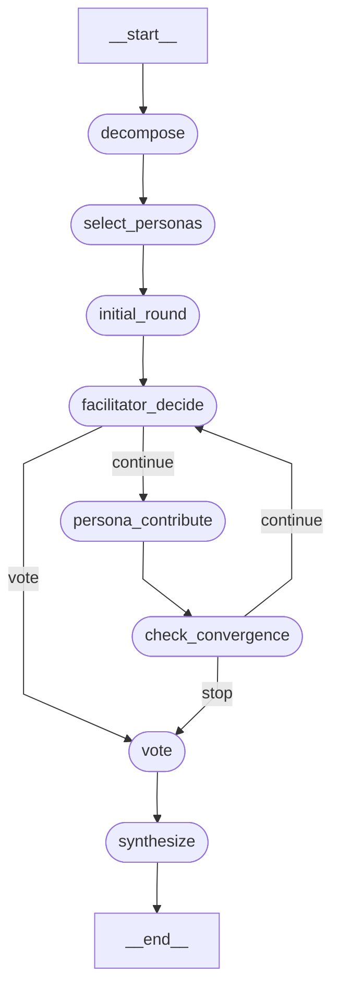
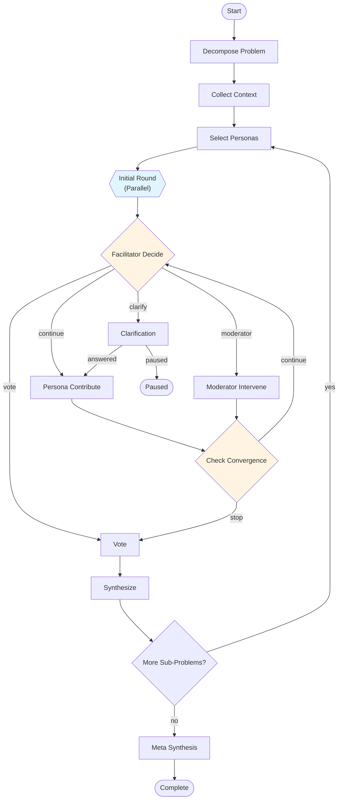

# Flow Notation and Configuration Systems Research

**Research Date**: 2025-11-22
**Purpose**: Inform design of a hierarchical, zoomable notation system for Board of One deliberation flows

---

## Executive Summary

After analyzing 5 major workflow notation systems (BPMN, LangGraph, Airflow, XState, WDL/Nextflow) and process algebras (CSP, π-calculus), the optimal approach for Board of One combines:

1. **XState-style hierarchical JSON** for configuration (nested states with clear initial/transitions)
2. **BPMN visual patterns** for documentation (standardized symbols for loops, gateways, subprocesses)
3. **LangGraph's node/edge model** for execution (already in use, proven for our use case)
4. **Nextflow's channel-based parallelism** concepts for multi-expert orchestration

**Key Recommendation**: Create a **3-layer abstraction system**:
- **Layer 1 (Executive)**: High-level process diagram (BPMN-inspired visual)
- **Layer 2 (Configuration)**: YAML/JSON workflow definition (XState-inspired hierarchy)
- **Layer 3 (Implementation)**: LangGraph Python code (current system)

---

## 1. BPMN (Business Process Model and Notation)

### Overview
BPMN 2.0 is an industry-standard graphical notation for business processes, with formal XML serialization for tool interoperability. Developed by OMG (Object Management Group), widely adopted in enterprise BPM systems.

### Strengths for Board of One

#### Loop Representation
BPMN has **three types of loops** that map well to our patterns:

1. **Standard Loop** (Do-While pattern)
   - Symbol: ⭯ (circular arrow at bottom of task)
   - Use case: Multi-round deliberation loop (continue while convergence not reached)
   - Example: `loopCondition="convergence_score &lt; 0.85"`

2. **Multi-Instance Sequential** (For-Each pattern)
   - Symbol: |||  (three vertical bars at bottom)
   - Use case: Processing sub-problems one-by-one
   - Example: `loopCardinality="count(sub_problems)"`

3. **Multi-Instance Parallel** (Parallel For-Each)
   - Symbol: ≡ (three horizontal bars at bottom)
   - Use case: Initial round with all personas contributing simultaneously
   - Example: `isSequential="false"` for parallel persona calls

#### Gateway Patterns
BPMN's gateway symbols handle our routing logic:

- **Exclusive Gateway (XOR)** - Diamond with X
  - Use case: Facilitator decision routing (vote | moderator | continue | clarify)
  - Only ONE outgoing path taken based on conditions

- **Parallel Gateway (AND)** - Diamond with +
  - Use case: Fork to multiple concurrent persona contributions
  - ALL outgoing paths taken simultaneously

- **Inclusive Gateway (OR)** - Diamond with O
  - Use case: Multiple personas may contribute (1 or more, not all required)

#### Nested Subprocesses
- **Collapsed Subprocess**: Shows as single rounded rectangle with + symbol
  - Use case: High-level "deliberate on sub-problem" abstraction
  - Expands to show: select_personas → initial_round → facilitator_loop → vote → synthesize

- **Call Activity**: References external reusable process definition
  - Use case: "Deliberation module" called for each sub-problem

#### XML Representation Example
```xml
<process id="deliberation" name="Multi-Round Deliberation">
  <!-- Standard Loop: Multi-round deliberation -->
  <task id="persona_contribute" name="Persona Contribute">
    <standardLoopCharacteristics>
      <loopCondition>${convergence_score &lt; 0.85}</loopCondition>
    </standardLoopCharacteristics>
  </task>

  <!-- Multi-Instance Parallel: Initial round -->
  <task id="initial_round" name="Initial Round">
    <multiInstanceLoopCharacteristics isSequential="false">
      <loopCardinality>${count(personas)}</loopCardinality>
    </multiInstanceLoopCharacteristics>
  </task>

  <!-- Exclusive Gateway: Facilitator decision -->
  <exclusiveGateway id="facilitator_decide" name="Route Decision">
    <outgoing>to_vote</outgoing>
    <outgoing>to_moderator</outgoing>
    <outgoing>to_continue</outgoing>
    <outgoing>to_clarify</outgoing>
  </exclusiveGateway>

  <sequenceFlow id="to_vote" sourceRef="facilitator_decide" targetRef="vote">
    <conditionExpression>${action == 'vote'}</conditionExpression>
  </sequenceFlow>

  <!-- Subprocess: Deliberate on sub-problem -->
  <subProcess id="sub_problem_deliberation" name="Deliberate Sub-Problem">
    <startEvent id="start_sp"/>
    <task id="select_personas"/>
    <task id="initial_round"/>
    <!-- ... nested flow ... -->
    <endEvent id="end_sp"/>
  </subProcess>
</process>
```

### Weaknesses
- **Too enterprise-focused**: Heavy XML, designed for SOA/BPEL execution engines
- **Not developer-friendly**: Engineers prefer code over visual tools
- **Limited abstraction**: Hard to represent dynamic list comprehensions or functional patterns
- **No native cost tracking**: Would need custom extensions for LLM cost analytics

### Applicability: **Medium-High**
- Excellent for **executive-facing documentation** (visual diagrams)
- XML too verbose for **configuration** (prefer YAML/JSON)
- Visual symbols useful for **communication** (stakeholder alignment)

**Recommended Use**: Borrow loop symbols (⭯, |||, ≡) and gateway diamonds for documentation diagrams, but don't adopt XML format.

### Sources
- [Camunda BPMN 2.0 Reference](https://camunda.com/bpmn/reference/)
- [Flows for APEX - BPMN Loops](https://flowsforapex.org/latest/iteration-loop-intro/)
- [Lucidchart BPMN Tutorial](https://www.lucidchart.com/pages/tutorial/bpmn)

---

## 2. LangGraph Visualization and Notation

### Overview
LangGraph is our current execution framework (LangChain's state machine library). It generates Mermaid diagrams for visualization and uses Python StateGraph API for configuration.

### Current Board of One Usage

#### Graph Structure (from `bo1/graph/config.py`)
```python
workflow = StateGraph(DeliberationGraphState)

# Nodes
workflow.add_node("decompose", decompose_node)
workflow.add_node("select_personas", select_personas_node)
workflow.add_node("initial_round", initial_round_node)
workflow.add_node("facilitator_decide", facilitator_decide_node)
workflow.add_node("persona_contribute", persona_contribute_node)
workflow.add_node("check_convergence", check_convergence_node)
workflow.add_node("vote", vote_node)
workflow.add_node("synthesize", synthesize_node)
workflow.add_node("meta_synthesis", meta_synthesize_node)

# Linear edges
workflow.add_edge("decompose", "context_collection")
workflow.add_edge("select_personas", "initial_round")
workflow.add_edge("initial_round", "facilitator_decide")

# Conditional edges (routers)
workflow.add_conditional_edges(
    "facilitator_decide",
    route_facilitator_decision,
    {
        "persona_contribute": "persona_contribute",
        "moderator_intervene": "moderator_intervene",
        "vote": "vote",
        "clarification": "clarification",
        "END": END,
    },
)

workflow.add_conditional_edges(
    "check_convergence",
    route_convergence_check,
    {
        "facilitator_decide": "facilitator_decide",  # Loop back
        "vote": "vote",
    },
)

workflow.set_entry_point("decompose")
graph = workflow.compile(checkpointer=actual_checkpointer)
```

#### Router Functions (from `bo1/graph/routers.py`)
```python
def route_facilitator_decision(
    state: DeliberationGraphState,
) -> Literal["vote", "moderator_intervene", "persona_contribute", "clarification", "END"]:
    """Route based on facilitator's action."""
    action = state["facilitator_decision"]["action"]

    if action == "vote":
        return "vote"
    elif action == "moderator":
        return "moderator_intervene"
    elif action == "continue":
        return "persona_contribute"
    elif action == "clarify":
        return "clarification"
    else:
        return "END"
```

#### Mermaid Visualization Output


### Strengths
- **Already in use**: No migration cost, proven for our architecture
- **Checkpointing built-in**: Redis-based pause/resume (7-day TTL)
- **Type-safe**: Python type hints for state transitions
- **Mermaid export**: Auto-generates diagrams from code
- **Recursion limits**: Safety guarantees (55 steps max)

### Weaknesses
- **No configuration layer**: Graph is defined in Python code, not declarative YAML/JSON
- **No hierarchy**: Flat node structure, can't collapse/expand subgraphs visually
- **Limited metadata**: No cost estimates, complexity scores, or phase annotations in graph definition
- **Router verbosity**: Each conditional edge requires separate router function

### Applicability: **Critical (Keep)**
LangGraph is the execution layer (Layer 3) and should NOT be replaced. The gap is the missing **configuration layer** (Layer 2) that would:
1. Define workflows declaratively (YAML/JSON)
2. Support hierarchy (nested subgraphs)
3. Include metadata (cost estimates, complexity)
4. Generate LangGraph code automatically

**Recommended Use**: Keep LangGraph as execution engine, build declarative config layer on top.

### Sources
- [LangGraph Graph API Overview](https://docs.langchain.com/oss/python/langgraph/graph-api)
- [LangGraph Visualization Notebook](https://github.com/langchain-ai/langgraph/blob/main/examples/visualization.ipynb)
- [Kite Metric - LangGraph Visualization Guide](https://kitemetric.com/blogs/visualizing-langgraph-workflows-with-get-graph)

---

## 3. Apache Airflow DAG Configuration

### Overview
Airflow is a Python-based workflow orchestration platform, primarily for data pipelines. DAGs (Directed Acyclic Graphs) are defined in Python code, NOT YAML (common misconception).

### Key Patterns

#### Branching with BranchPythonOperator
```python
from airflow.operators.python import BranchPythonOperator

def decide_next_action(**context):
    """Similar to our facilitator_decide router"""
    action = context['ti'].xcom_pull(key='facilitator_action')

    if action == 'vote':
        return 'vote_task'
    elif action == 'moderator':
        return 'moderator_task'
    else:
        return 'persona_contribute_task'

branch_task = BranchPythonOperator(
    task_id='facilitator_decide',
    python_callable=decide_next_action,
    dag=dag,
)

branch_task >> [vote_task, moderator_task, persona_contribute_task]
```

#### Dynamic Task Mapping (Airflow 2.3+)
```python
from airflow.decorators import task

@task
def get_personas():
    """Return list of persona codes"""
    return ['MARIA', 'ZARA', 'TARIQ']

@task
def persona_contribute(persona_code: str):
    """Run contribution for single persona"""
    return call_persona_api(persona_code)

# Dynamic task mapping - creates task for each persona
persona_codes = get_personas()
contributions = persona_contribute.expand(persona_code=persona_codes)
```

#### Join with Trigger Rules
```python
from airflow.operators.dummy import DummyOperator
from airflow.utils.trigger_rule import TriggerRule

# Join after branching - runs when ANY upstream completes
join_task = DummyOperator(
    task_id='check_convergence',
    trigger_rule=TriggerRule.NONE_FAILED_MIN_ONE_SUCCESS,
    dag=dag,
)

[vote_task, moderator_task, persona_contribute_task] >> join_task
```

#### Nested Branching Example
```python
# Airflow's official example_nested_branch_dag
# Shows multi-level decision trees similar to our facilitator → clarification flow

level_1_branch = BranchPythonOperator(task_id='level_1', ...)
level_2_branch = BranchPythonOperator(task_id='level_2', ...)

level_1_branch >> level_2_branch >> [option_a, option_b, option_c]
```

### Strengths
- **Python-native**: Familiar to developers, easy to debug
- **Dynamic task generation**: `expand()` for list-based parallelism (like our initial_round)
- **Rich operators**: 1000+ integrations (Kubernetes, Postgres, Slack, etc.)
- **Mature ecosystem**: 10+ years, battle-tested at Airbnb, LinkedIn, etc.

### Weaknesses for Board of One
- **DAG constraint**: Doesn't support cycles (deliberation loop violates this!)
- **No built-in loops**: Workarounds exist (sensors, recursive DAGs) but hacky
- **Batch-oriented**: Designed for hourly/daily jobs, not interactive sessions
- **No LLM primitives**: No cost tracking, prompt caching, streaming, etc.
- **Heavy**: Requires scheduler, workers, database - overkill for single-process deliberations

### Applicability: **Low**
Airflow's DAG constraint (acyclic graphs) is a dealbreaker for multi-round deliberation loops. While it has excellent branching and parallel execution, the lack of native loop support makes it unsuitable.

**Recommended Use**: Borrow the **dynamic task mapping pattern** (`expand()`) for expressing "for each persona" parallelism in config.

### Sources
- [Airflow DAGs Documentation](https://airflow.apache.org/docs/apache-airflow/stable/core-concepts/dags.html)
- [Airflow Branching Operators](https://www.astronomer.io/docs/learn/airflow-branch-operator/)
- [Dynamic Task Mapping](https://airflow.apache.org/docs/apache-airflow/stable/authoring-and-scheduling/dynamic-task-mapping.html)

---

## 4. XState Hierarchical Statecharts

### Overview
XState is a JavaScript library for state machines and statecharts (Harel statecharts extended). Supports hierarchical (nested) states with JSON configuration.

### Hierarchical State Example

#### Pedestrian Light with Nested States
```javascript
const pedestrianStates = {
  initial: 'walk',
  states: {
    walk: {
      on: { PED_TIMER: 'wait' }
    },
    wait: {
      on: { PED_TIMER: 'stop' }
    },
    stop: {
      on: { PED_TIMER: 'walk' }
    }
  }
};

const lightMachine = createMachine({
  id: 'light',
  initial: 'green',
  states: {
    green: {
      on: { TIMER: 'yellow' }
    },
    yellow: {
      on: { TIMER: 'red' }
    },
    red: {
      on: { TIMER: 'green' },
      // Nested states - only active when parent 'red' is active
      ...pedestrianStates
    }
  }
});
```

#### Board of One Mapping
```javascript
const deliberationMachine = createMachine({
  id: 'deliberation',
  initial: 'setup',
  states: {
    setup: {
      initial: 'decompose',
      states: {
        decompose: { on: { COMPLETE: 'select_personas' } },
        select_personas: { on: { COMPLETE: 'initial_round' } },
        initial_round: { on: { COMPLETE: 'discussion' } }
      },
      on: {
        COMPLETE: 'discussion'
      }
    },

    discussion: {
      initial: 'facilitator_decide',
      states: {
        facilitator_decide: {
          on: {
            VOTE: '#deliberation.voting',
            MODERATOR: 'moderator_intervene',
            CONTINUE: 'persona_contribute',
            CLARIFY: 'clarification'
          }
        },

        persona_contribute: {
          on: { COMPLETE: 'check_convergence' }
        },

        moderator_intervene: {
          on: { COMPLETE: 'check_convergence' }
        },

        clarification: {
          on: {
            ANSWERED: 'persona_contribute',
            PAUSED: '#deliberation.paused'
          }
        },

        check_convergence: {
          on: {
            CONTINUE: 'facilitator_decide',  // Loop back
            STOP: '#deliberation.voting'
          }
        }
      }
    },

    voting: {
      initial: 'collect_votes',
      states: {
        collect_votes: { on: { COMPLETE: 'synthesize' } },
        synthesize: { on: { COMPLETE: 'check_more_subproblems' } },
        check_more_subproblems: {
          on: {
            NEXT: '#deliberation.setup',  // Reset to setup for next sub-problem
            META: 'meta_synthesis',
            DONE: '#deliberation.complete'
          }
        },
        meta_synthesis: { on: { COMPLETE: '#deliberation.complete' } }
      }
    },

    paused: {
      on: { RESUME: 'discussion' }
    },

    complete: {
      type: 'final'
    }
  }
});
```

### Key Concepts

#### Hierarchical States
- **Compound states**: States with nested substates (e.g., `discussion` contains `facilitator_decide`, `persona_contribute`, etc.)
- **Initial property**: Defines which substate is entered first
- **State paths**: `setup.decompose`, `discussion.persona_contribute`

#### Absolute Transitions
- **Syntax**: `#deliberation.voting` (# prefix for absolute path)
- **Use case**: Jump from deep nesting to sibling branch (e.g., clarification → voting)

#### History States
- **Shallow history**: Remembers last substate of parent
- **Deep history**: Remembers entire nested state path
- **Use case**: Resume deliberation after pause

### Strengths for Board of One

#### Clear Hierarchy
- **Setup phase** (decompose, select, initial_round) as compound state
- **Discussion loop** (facilitator, contribute, convergence) as compound state
- **Voting phase** (vote, synthesize, check_next) as compound state

#### JSON Configuration
```json
{
  "id": "deliberation",
  "initial": "setup",
  "states": {
    "setup": {
      "initial": "decompose",
      "states": {
        "decompose": { "on": { "COMPLETE": "select_personas" } },
        "select_personas": { "on": { "COMPLETE": "initial_round" } }
      }
    },
    "discussion": { ... }
  }
}
```

#### Guards and Actions
```javascript
{
  states: {
    check_convergence: {
      on: {
        EVALUATE: [
          { target: 'voting', guard: 'isConverged' },
          { target: 'facilitator_decide', guard: 'canContinue' },
          { target: 'voting', guard: 'maxRoundsReached' }
        ]
      }
    }
  }
},
{
  guards: {
    isConverged: (context) => context.convergence_score > 0.85,
    canContinue: (context) => context.round_number < context.max_rounds,
    maxRoundsReached: (context) => context.round_number >= context.max_rounds
  }
}
```

### Weaknesses
- **JavaScript-centric**: No official Python port (some community attempts)
- **Event-driven model**: Assumes external events trigger transitions (vs our function-call model)
- **No cost tracking**: No primitives for LLM cost, token usage, etc.
- **Flat execution**: No built-in parallelism (would need to implement parallel states manually)

### Applicability: **High**
XState's hierarchical JSON structure is **ideal for our configuration layer**. We should:
1. Adopt nested `states` structure with `initial` property
2. Use compound states for phases (setup, discussion, voting)
3. Support absolute transitions (`#deliberation.voting`)
4. Add custom extensions for parallelism, cost tracking, LLM metadata

**Recommended Use**: Primary inspiration for YAML/JSON configuration format (Layer 2).

### Sources
- [XState Documentation (v3)](https://xstate.js.org/docs-v3/)
- [XState Hierarchical States Guide](https://github.com/statelyai/xstate/blob/main/docs/guides/hierarchical.md)
- [egghead.io - Hierarchical States in XState](https://egghead.io/lessons/xstate-simplify-state-explosion-in-xstate-through-hierarchical-states)

---

## 5. Workflow Languages (WDL, CWL, Nextflow)

### Overview
Domain-specific languages for bioinformatics pipelines. WDL (Workflow Description Language) and CWL (Common Workflow Language) are declarative specifications, while Nextflow is a Groovy-based DSL with runtime.

### WDL Scatter-Gather Pattern

#### Scatter Example (Parallel Persona Contributions)
```wdl
workflow deliberation {
  Array[String] persona_codes = ["MARIA", "ZARA", "TARIQ"]
  File problem_context

  # Scatter: Run persona_contribute for each code in parallel
  scatter (code in persona_codes) {
    call persona_contribute {
      input:
        persona_code = code,
        context = problem_context
    }
  }

  # Gather: Collect all contributions
  call check_convergence {
    input:
      contributions = persona_contribute.contribution  # Array of outputs
  }

  output {
    File convergence_report = check_convergence.report
  }
}

task persona_contribute {
  input {
    String persona_code
    File context
  }

  command {
    python call_persona.py --code ${persona_code} --context ${context}
  }

  output {
    File contribution = "contribution_${persona_code}.json"
  }
}
```

#### Nested Scatter (Multi-Sub-Problem Processing)
```wdl
workflow multi_sub_problem {
  Array[SubProblem] sub_problems

  scatter (sp in sub_problems) {
    call select_personas { input: sub_problem = sp }

    # Nested scatter: For each persona in selected_personas
    scatter (persona in select_personas.persona_codes) {
      call persona_contribute { input: persona_code = persona, sp = sp }
    }

    call synthesize { input: contributions = persona_contribute.contribution }
  }

  call meta_synthesize { input: syntheses = synthesize.output }
}
```

### Nextflow Channel-Based Parallelism

#### Process Definition
```groovy
process persona_contribute {
  input:
    val persona_code
    path context_file

  output:
    path "contribution_${persona_code}.json"

  script:
  """
  python call_persona.py --code ${persona_code} --context ${context_file}
  """
}

workflow {
  // Create channel with persona codes
  persona_codes = Channel.from(['MARIA', 'ZARA', 'TARIQ'])
  context_file = Channel.fromPath('problem_context.json')

  // Combine inputs and run process for each
  persona_contribute(persona_codes, context_file)

  // Collect outputs into single channel
  contributions = persona_contribute.out.collect()

  // Pass to next process
  check_convergence(contributions)
}
```

#### Multi-Sub-Problem Loop
```groovy
workflow {
  sub_problems = Channel.fromPath('sub_problems/*.json')

  sub_problems
    .flatMap { sp ->
      select_personas(sp)
        .splitJson()
        .map { persona_code -> [sp, persona_code] }
    }
    .set { sp_persona_pairs }

  persona_contribute(sp_persona_pairs)
    .groupTuple()  // Group by sub-problem
    .set { grouped_contributions }

  synthesize(grouped_contributions)
}
```

### Key Concepts

#### Scatter-Gather (WDL/CWL)
- **Scatter**: Declarative parallelism (like `map()` or `forEach()`)
- **Implicit gather**: Outputs automatically collected into arrays
- **Type-safe**: Compiler knows `scatter` produces `Array[T]`

#### Channels (Nextflow)
- **Queue channels**: Stream of values (like Python generator)
- **Value channels**: Single value, reusable
- **Operators**: `map()`, `filter()`, `groupTuple()`, `collect()`
- **Lazy evaluation**: Processes run only when data available

### Strengths
- **Declarative scatter**: Cleaner than imperative loops for parallelism
- **Implicit data flow**: No manual passing of outputs to inputs (channel binding)
- **Reproducibility**: Explicit inputs/outputs enable caching and resume
- **Scalability**: Auto-scales to HPC clusters, cloud, Kubernetes

### Weaknesses for Board of One
- **No loops**: WDL/CWL don't support while loops (scatter only)
  - Until March 2020, nested conditionals within loops not supported in WDL
  - Nested loops in WDL draft-2 not executable by Cromwell engine
- **Batch-oriented**: Designed for file-based pipelines (FASTQ → BAM → VCF)
- **Not interactive**: No pause/resume for human input mid-workflow
- **Heavy runtimes**: Cromwell (WDL), Toil (CWL), Nextflow Tower all require infrastructure

### Applicability: **Medium**
WDL/CWL's scatter-gather is **excellent for expressing parallelism** but limited to batch processing. Nextflow's channels are more flexible but require runtime infrastructure.

**Recommended Use**:
- Borrow **scatter syntax** for parallel operations in config (`scatter: {over: personas, task: contribute}`)
- Adopt **implicit gather** pattern (outputs auto-collected)
- **Don't adopt**: Full workflow language runtime (too heavy)

### Sources
- [WDL Scatter Documentation](https://docs.openwdl.org/en/latest/WDL/scattering_array/)
- [Nextflow DSL2 Documentation](https://www.nextflow.io/docs/latest/dsl2.html)
- [Nextflow vs WDL Comparison](https://www.nextflow.io/podcast/2024/ep46_nextflow_vs_wdl.html)

---

## 6. Process Algebras (CSP, π-calculus)

### Overview
Formal mathematical systems for modeling concurrent processes. CSP (Communicating Sequential Processes) and π-calculus provide theoretical foundations for process interaction.

### CSP Notation

#### Basic Operators
```
P ; Q       Sequential composition (P then Q)
P ||| Q     Parallel composition (P and Q concurrently)
P [] Q      External choice (environment chooses P or Q)
P |~| Q     Internal choice (process chooses P or Q)
P >> Q      Sequential with output passing
```

#### Board of One Example
```
DELIBERATION =
  DECOMPOSE ;
  SELECT_PERSONAS ;
  INITIAL_ROUND ;
  DISCUSSION_LOOP

INITIAL_ROUND =
  (MARIA ||| ZARA ||| TARIQ) >> COLLECT

DISCUSSION_LOOP =
  FACILITATOR_DECIDE ; (
    (action == vote → VOTING) []
    (action == moderator → MODERATOR ; DISCUSSION_LOOP) []
    (action == continue → PERSONA_CONTRIBUTE ; DISCUSSION_LOOP) []
    (action == clarify → CLARIFICATION ; DISCUSSION_LOOP)
  )
```

### π-calculus Notation

#### Basic Syntax
```
P | Q           Parallel composition
c!v.P           Output v on channel c, then P
c?x.P           Input from channel c into x, then P
(νc)P           Create new private channel c
!P              Replication (infinite copies of P)
```

#### Board of One Example
```
SYSTEM = (νfacilitator, personas)(
  FACILITATOR | MARIA | ZARA | TARIQ
)

FACILITATOR =
  problem!desc.
  personas?contributions.
  (
    convergence_check!contributions.
    decision?action.
    match action with
    | vote → voting!contributions
    | moderator → moderator!alert. FACILITATOR
    | continue → personas!prompt. FACILITATOR
    | clarify → user!question. user?answer. FACILITATOR
  )

MARIA =
  problem?desc.
  prompt?context.
  contribute!response.
  MARIA
```

### Strengths
- **Formal semantics**: Mathematically rigorous, provable properties
- **Concurrency primitives**: Natural expression of parallel processes
- **Channel abstraction**: Clean model for message passing (personas communicating)
- **Process mobility**: π-calculus supports dynamic process creation (like our dynamic persona selection)

### Weaknesses for Board of One
- **Too theoretical**: Not practical for configuration or implementation
- **No tooling**: No compilers, debuggers, or visualization tools
- **No data structures**: Only processes and channels (no lists, dicts, state machines)
- **Steep learning curve**: Requires formal methods background

### Applicability: **Very Low**
Process algebras provide **conceptual foundations** (parallel composition, choice operators) but are too abstract for practical use. They influenced BPMN and workflow languages, so benefits are already captured in other systems.

**Recommended Use**: **Conceptual reference only** - understand parallel (|||) vs sequential (;) composition, but don't adopt notation.

### Sources
- [CSP: A Practical Process Algebra (Oxford)](https://www.cs.ox.ac.uk/files/12724/cspfdrstory.pdf)
- [Process Calculus - Wikipedia](https://en.wikipedia.org/wiki/Process_calculus)
- [Pi-Calculus - EduTech Wiki](https://edutechwiki.unige.ch/en/Pi-Calculus)

---

## Synthesis: Recommended Design Language

### 3-Layer Abstraction System

#### Layer 1: Executive Visualization (BPMN-Inspired)
**Purpose**: High-level process diagram for stakeholders
**Format**: Mermaid diagram with BPMN symbols
**Audience**: Product managers, executives, domain experts

**Example**: Multi-round deliberation overview


**BPMN Symbol Legend**:
- ⭯ Standard Loop (multi-round deliberation)
- ||| Parallel Multi-Instance (initial round)
- ◇ Exclusive Gateway (facilitator decision)
- ⬭ Subprocess (deliberate sub-problem)

---

#### Layer 2: Configuration (YAML/JSON, XState-Inspired)

**Purpose**: Declarative workflow definition
**Format**: YAML with hierarchical states
**Audience**: Developers, DevOps, workflow engineers

**Example**: `deliberation_config.yaml`
```yaml
workflow:
  id: deliberation_v2
  version: "2.1.0"

  # Metadata
  description: "Multi-round expert deliberation with synthesis"
  cost_estimate: "$0.10-0.15 per sub-problem"
  avg_duration: "5-15 minutes"

  # Global configuration
  config:
    max_rounds: 10
    convergence_threshold: 0.85
    checkpoint_ttl: 604800  # 7 days
    redis_url: "${REDIS_URL}"

  # Initial state
  initial: setup

  # Hierarchical states
  states:

    # ===== SETUP PHASE =====
    setup:
      description: "Problem decomposition and persona selection"
      initial: decompose

      states:
        decompose:
          type: task
          agent: DecomposerAgent
          inputs:
            - problem.description
            - problem.context
          outputs:
            - problem.sub_problems
          cost_phase: "problem_decomposition"
          on:
            COMPLETE: context_collection

        context_collection:
          type: task
          agent: ContextCollectorAgent
          inputs:
            - problem.sub_problems
            - user.id
          outputs:
            - problem.context_enriched
          cost_phase: "context_collection"
          on:
            COMPLETE: select_personas

        select_personas:
          type: task
          agent: PersonaSelectorAgent
          inputs:
            - current_sub_problem
            - problem.context_enriched
          outputs:
            - personas
            - persona_recommendations
          cost_phase: "persona_selection"
          on:
            COMPLETE: initial_round

        initial_round:
          type: parallel
          description: "All personas contribute simultaneously"
          scatter:
            over: personas
            task: persona_contribute_initial
          gather: contributions
          cost_phase: "initial_round"
          on:
            COMPLETE: "#deliberation.discussion"

      # Exit to discussion phase
      on:
        COMPLETE: discussion

    # ===== DISCUSSION PHASE =====
    discussion:
      description: "Multi-round deliberation loop with facilitator orchestration"
      initial: facilitator_decide

      states:
        facilitator_decide:
          type: task
          agent: FacilitatorAgent
          inputs:
            - contributions
            - round_number
            - convergence_metrics
          outputs:
            - facilitator_decision
          cost_phase: "facilitator_orchestration"
          on:
            VOTE: "#deliberation.voting"
            MODERATOR: moderator_intervene
            CONTINUE: persona_contribute
            CLARIFY: clarification

        persona_contribute:
          type: task
          agent: PersonaAgent
          inputs:
            - current_round_context
            - persona_code
          outputs:
            - contribution
          cost_phase: "persona_contribution"
          on:
            COMPLETE: check_convergence

        moderator_intervene:
          type: task
          agent: ModeratorAgent
          inputs:
            - contributions
            - facilitator_alert
          outputs:
            - moderator_guidance
          cost_phase: "moderator_intervention"
          on:
            COMPLETE: check_convergence

        clarification:
          type: interaction
          description: "Request user input for blocking questions"
          prompt_user:
            question: "${facilitator_decision.clarification_question}"
            options:
              - "Answer now"
              - "Pause session"
              - "Skip question"
          outputs:
            - clarification_response
          on:
            ANSWERED: persona_contribute
            SKIPPED: persona_contribute
            PAUSED: "#deliberation.paused"

        check_convergence:
          type: task
          agent: ConvergenceChecker
          inputs:
            - contributions
            - round_number
            - max_rounds
          outputs:
            - convergence_score
            - should_stop
            - stop_reason
          guards:
            is_converged: "convergence_score > 0.85 and round_number >= 3"
            max_rounds_reached: "round_number >= max_rounds"
          on:
            CONTINUE:
              target: facilitator_decide
              guard: "not should_stop"
            STOP:
              target: "#deliberation.voting"
              guard: "should_stop"

      # Loop back to facilitator
      on:
        CONTINUE: facilitator_decide
        STOP: "#deliberation.voting"

    # ===== VOTING PHASE =====
    voting:
      description: "Collect recommendations and synthesize"
      initial: collect_recommendations

      states:
        collect_recommendations:
          type: parallel
          scatter:
            over: personas
            task: persona_recommend
          gather: recommendations
          cost_phase: "recommendation_collection"
          on:
            COMPLETE: synthesize

        synthesize:
          type: task
          agent: SynthesizerAgent
          inputs:
            - recommendations
            - current_sub_problem
            - all_contributions
          outputs:
            - synthesis
            - sub_problem_results
          cost_phase: "synthesis"
          on:
            COMPLETE: check_next_sub_problem

        check_next_sub_problem:
          type: router
          guards:
            atomic_problem: "len(problem.sub_problems) == 1"
            has_more: "sub_problem_index + 1 < len(problem.sub_problems)"
            all_complete: "sub_problem_index + 1 >= len(problem.sub_problems)"
          on:
            ATOMIC:
              target: "#deliberation.complete"
              guard: "atomic_problem"
            NEXT:
              target: "#deliberation.setup.next_subproblem"
              guard: "has_more"
            META:
              target: meta_synthesis
              guard: "all_complete"

        next_subproblem:
          type: task
          action: increment_sub_problem_index
          on:
            COMPLETE: "#deliberation.setup.select_personas"

        meta_synthesis:
          type: task
          agent: MetaSynthesizerAgent
          inputs:
            - sub_problem_results
            - problem.description
          outputs:
            - final_synthesis
          cost_phase: "meta_synthesis"
          on:
            COMPLETE: "#deliberation.complete"

    # ===== PAUSED STATE =====
    paused:
      description: "Session paused awaiting user action"
      type: final_interruptible
      checkpoint: true
      on:
        RESUME: discussion

    # ===== COMPLETE STATE =====
    complete:
      type: final
      outputs:
        - final_synthesis
        - metrics
        - session_id

# Custom extensions for LLM workflows
extensions:

  # Cost tracking phases
  cost_phases:
    - problem_decomposition
    - context_collection
    - persona_selection
    - initial_round
    - facilitator_orchestration
    - persona_contribution
    - moderator_intervention
    - recommendation_collection
    - synthesis
    - meta_synthesis

  # Convergence metrics
  convergence:
    threshold: 0.85
    min_rounds: 3
    max_rounds: 10
    novelty_threshold: 0.3

  # Loop prevention
  safety:
    recursion_limit: 55
    timeout_seconds: 3600
    cost_kill_switch: true
    max_cost_usd: 5.00
```

**Key Features**:
1. **Hierarchical states**: `setup.decompose`, `discussion.facilitator_decide`
2. **Absolute transitions**: `#deliberation.voting` (jump across hierarchy)
3. **Scatter-gather**: `scatter: {over: personas, task: contribute}`
4. **Guards**: `guard: "convergence_score > 0.85"`
5. **Cost tracking**: `cost_phase: "persona_contribution"`
6. **Metadata**: Cost estimates, duration, description

---

#### Layer 3: Implementation (LangGraph Python)

**Purpose**: Execution engine
**Format**: Python code (current system)
**Audience**: Core developers

**Example**: Generated from Layer 2 config (conceptual)
```python
# Auto-generated from deliberation_config.yaml
# DO NOT EDIT MANUALLY - regenerate with: python -m bo1.codegen.generate_graph

from langgraph.graph import StateGraph, END
from bo1.graph.state import DeliberationGraphState
from bo1.graph.nodes import *
from bo1.graph.routers import *

def create_deliberation_graph_v2():
    """Generated from deliberation_config.yaml v2.1.0"""

    workflow = StateGraph(DeliberationGraphState)

    # Setup phase nodes
    workflow.add_node("decompose", decompose_node)
    workflow.add_node("context_collection", context_collection_node)
    workflow.add_node("select_personas", select_personas_node)
    workflow.add_node("initial_round", initial_round_node)  # Parallel scatter

    # Discussion phase nodes
    workflow.add_node("facilitator_decide", facilitator_decide_node)
    workflow.add_node("persona_contribute", persona_contribute_node)
    workflow.add_node("moderator_intervene", moderator_intervene_node)
    workflow.add_node("clarification", clarification_node)
    workflow.add_node("check_convergence", check_convergence_node)

    # Voting phase nodes
    workflow.add_node("vote", vote_node)  # Parallel scatter
    workflow.add_node("synthesize", synthesize_node)
    workflow.add_node("next_subproblem", next_subproblem_node)
    workflow.add_node("meta_synthesis", meta_synthesize_node)

    # Setup phase edges
    workflow.add_edge("decompose", "context_collection")
    workflow.add_edge("context_collection", "select_personas")
    workflow.add_edge("select_personas", "initial_round")
    workflow.add_edge("initial_round", "facilitator_decide")

    # Discussion phase edges
    workflow.add_conditional_edges(
        "facilitator_decide",
        route_facilitator_decision,
        {
            "persona_contribute": "persona_contribute",
            "moderator_intervene": "moderator_intervene",
            "vote": "vote",
            "clarification": "clarification",
            "END": END,
        },
    )

    workflow.add_edge("persona_contribute", "check_convergence")
    workflow.add_edge("moderator_intervene", "check_convergence")

    workflow.add_conditional_edges(
        "clarification",
        route_clarification,
        {
            "persona_contribute": "persona_contribute",
            "END": END,  # Paused
        },
    )

    workflow.add_conditional_edges(
        "check_convergence",
        route_convergence_check,
        {
            "facilitator_decide": "facilitator_decide",  # Loop
            "vote": "vote",
        },
    )

    # Voting phase edges
    workflow.add_edge("vote", "synthesize")
    workflow.add_conditional_edges(
        "synthesize",
        route_after_synthesis,
        {
            "next_subproblem": "next_subproblem",
            "meta_synthesis": "meta_synthesis",
            "END": END,
        },
    )

    workflow.add_edge("next_subproblem", "select_personas")
    workflow.add_edge("meta_synthesis", END)

    workflow.set_entry_point("decompose")

    return workflow.compile(
        checkpointer=create_redis_checkpointer(),
    )
```

---

### Handling Board of One Patterns

#### Pattern 1: Multi-Round Discussion Loop
**YAML Config**:
```yaml
discussion:
  states:
    check_convergence:
      guards:
        should_continue: "not should_stop"
        should_stop: "should_stop"
      on:
        CONTINUE:
          target: facilitator_decide
          guard: "should_continue"
        STOP:
          target: "#deliberation.voting"
          guard: "should_stop"
```

**Visual (BPMN-inspired)**:
```
[Persona Contribute] --> [Check Convergence] --continue--> [Facilitator Decide] (LOOP BACK)
                                              --stop--> [Vote]
```

**Symbols**: ⭯ (standard loop) on "Persona Contribute" task

---

#### Pattern 2: Multi-Sub-Problem Processing
**YAML Config**:
```yaml
voting:
  states:
    check_next_sub_problem:
      guards:
        has_more: "sub_problem_index + 1 < len(problem.sub_problems)"
      on:
        NEXT:
          target: "#deliberation.setup.select_personas"
          guard: "has_more"
        META:
          target: meta_synthesis
          guard: "not has_more"
```

**Visual (BPMN-inspired)**:
```
[Synthesize] --> {More Sub-Problems?} --yes--> [Select Personas] (LOOP TO NEXT SP)
                                      --no--> [Meta Synthesis]
```

**Symbols**: ||| (multi-instance sequential) on "Deliberate Sub-Problem" subprocess

---

#### Pattern 3: Conditional Facilitator Decisions
**YAML Config**:
```yaml
facilitator_decide:
  type: task
  outputs:
    - facilitator_decision
  on:
    VOTE: "#deliberation.voting"
    MODERATOR: moderator_intervene
    CONTINUE: persona_contribute
    CLARIFY: clarification
```

**Visual (BPMN-inspired)**:
```
[Facilitator Decide] --vote--> [Vote]
                    --moderator--> [Moderator Intervene]
                    --continue--> [Persona Contribute]
                    --clarify--> [Clarification]
```

**Symbols**: ◇ (exclusive gateway) after "Facilitator Decide"

---

#### Pattern 4: Parallel Initial Round
**YAML Config**:
```yaml
initial_round:
  type: parallel
  scatter:
    over: personas
    task: persona_contribute_initial
  gather: contributions
```

**Visual (BPMN-inspired)**:
```
[Select Personas] --> [Initial Round] (3 parallel tasks: MARIA || ZARA || TARIQ) --> [Facilitator Decide]
```

**Symbols**: ≡ (multi-instance parallel) on "Initial Round" task

---

### Benefits of 3-Layer System

#### For Stakeholders (Layer 1)
- **Visual overview**: Mermaid diagram shows flow at a glance
- **Standard symbols**: BPMN patterns (loops, gateways) are familiar to business analysts
- **No code**: Can understand process without reading Python/YAML

#### For Developers (Layer 2)
- **Declarative config**: Change workflow without touching Python code
- **Version control**: YAML diffs show exactly what changed
- **Testable**: Validate config against schema before deployment
- **Metadata-rich**: Cost estimates, descriptions, complexity scores embedded

#### For Core Team (Layer 3)
- **Generated code**: Reduces manual LangGraph wiring errors
- **Type-safe**: Python type hints catch bugs at compile time
- **Debuggable**: Can step through actual node execution
- **Extensible**: Add custom nodes/routers without changing config schema

---

## Implementation Roadmap

### Phase 1: Config Schema Design (Week 1)
**Deliverables**:
- [ ] YAML schema for workflow definition (`deliberation_config.schema.json`)
- [ ] JSON schema validator
- [ ] Example configs for current Board of One flows
- [ ] Documentation: Config reference guide

**Tools**: JSON Schema, Pydantic models

---

### Phase 2: Code Generator (Week 2-3)
**Deliverables**:
- [ ] `bo1.codegen.generate_graph` - YAML → LangGraph Python
- [ ] Template system for nodes, routers, edges
- [ ] Validation: Generated code matches manual graph
- [ ] CI check: Config changes trigger regeneration

**Tools**: Jinja2 templates, AST manipulation (libcst)

---

### Phase 3: Visualization Engine (Week 4)
**Deliverables**:
- [ ] YAML → Mermaid converter
- [ ] Interactive web UI (zoom, collapse, expand)
- [ ] BPMN symbol overlays (⭯, |||, ≡, ◇)
- [ ] Cost heatmap (color nodes by cost phase)

**Tools**: Mermaid.js, D3.js for interactivity

---

### Phase 4: Migration (Week 5-6)
**Deliverables**:
- [ ] Migrate existing graph to YAML config
- [ ] Deprecate manual `config.py` (generate from YAML)
- [ ] Update docs: "How to modify workflow"
- [ ] Regression tests: Ensure behavior unchanged

---

### Phase 5: Extensions (Week 7+)
**Deliverables**:
- [ ] Cost optimizer: Suggest cheaper node implementations
- [ ] Complexity analyzer: Estimate tokens, duration per path
- [ ] A/B testing: Define multiple config variants
- [ ] Workflow library: Reusable subgraphs (e.g., "deliberation_loop")

---

## Comparison Matrix

| Feature | BPMN | LangGraph | Airflow | XState | WDL/Nextflow | CSP/π-calculus |
|---------|------|-----------|---------|--------|--------------|----------------|
| **Hierarchy** | ⭐⭐ (subprocesses) | ❌ (flat) | ❌ (flat) | ⭐⭐⭐ (nested states) | ⭐ (limited) | ❌ |
| **Loops** | ⭐⭐⭐ (3 types) | ⭐⭐ (conditional edges) | ❌ (DAG only) | ⭐⭐ (transitions) | ⭐ (scatter only) | ⭐ (replication) |
| **Parallelism** | ⭐⭐⭐ (multi-instance) | ⭐ (manual) | ⭐⭐⭐ (dynamic) | ⭐ (parallel states) | ⭐⭐⭐ (scatter, channels) | ⭐⭐ (||| operator) |
| **Config Format** | XML (verbose) | Python (code) | Python (code) | JSON (clean) | WDL/Groovy (DSL) | Notation only |
| **Visual Notation** | ⭐⭐⭐ (standard) | ⭐⭐ (Mermaid) | ⭐ (basic DAG) | ⭐ (statecharts) | ❌ | ❌ |
| **Tooling** | ⭐⭐⭐ (mature) | ⭐⭐ (growing) | ⭐⭐⭐ (mature) | ⭐⭐ (JS-focused) | ⭐⭐ (niche) | ❌ |
| **Learning Curve** | Medium | Low | Medium | Medium-High | High | Very High |
| **Adoption for BO1** | Documentation | ✅ Keep | ❌ No loops | ✅ Config layer | Patterns only | Conceptual |

**Legend**:
- ⭐⭐⭐ Excellent
- ⭐⭐ Good
- ⭐ Limited
- ❌ Not suitable

---

## Conclusion

**Primary Recommendation**: Adopt **XState-inspired hierarchical YAML** for configuration (Layer 2), generate **LangGraph Python** code (Layer 3), and create **BPMN-style Mermaid diagrams** for documentation (Layer 1).

**Key Borrowings**:
1. **XState**: Nested states with `initial`, compound states, absolute transitions (`#deliberation.voting`)
2. **BPMN**: Visual symbols (⭯ loops, ◇ gateways, ≡ parallel), subprocess abstraction
3. **WDL/Nextflow**: Scatter-gather pattern for parallelism (`scatter: {over: personas}`)
4. **LangGraph**: Keep as execution engine (proven, checkpointing, type-safe)

**Avoid**:
- BPMN XML (too verbose)
- Airflow DAGs (no loops)
- Process algebras (too theoretical)
- Full workflow runtimes (Cromwell, Nextflow Tower - too heavy)

**Next Steps**:
1. Design YAML schema (JSON Schema definition)
2. Implement code generator (YAML → LangGraph)
3. Build visualization engine (YAML → Mermaid)
4. Migrate existing graph to config-driven system
5. Add extensions (cost optimizer, complexity analyzer)

---

## Sources

- [Camunda BPMN 2.0 Reference](https://camunda.com/bpmn/reference/)
- [Flows for APEX - BPMN Loops](https://flowsforapex.org/latest/iteration-loop-intro/)
- [Lucidchart BPMN Tutorial](https://www.lucidchart.com/pages/tutorial/bpmn)
- [LangGraph Graph API Overview](https://docs.langchain.com/oss/python/langgraph/graph-api)
- [LangGraph Visualization Notebook](https://github.com/langchain-ai/langgraph/blob/main/examples/visualization.ipynb)
- [Kite Metric - LangGraph Visualization Guide](https://kitemetric.com/blogs/visualizing-langgraph-workflows-with-get-graph)
- [Airflow DAGs Documentation](https://airflow.apache.org/docs/apache-airflow/stable/core-concepts/dags.html)
- [Airflow Branching Operators](https://www.astronomer.io/docs/learn/airflow-branch-operator/)
- [Dynamic Task Mapping](https://airflow.apache.org/docs/apache-airflow/stable/authoring-and-scheduling/dynamic-task-mapping.html)
- [XState Documentation (v3)](https://xstate.js.org/docs-v3/)
- [XState Hierarchical States Guide](https://github.com/statelyai/xstate/blob/main/docs/guides/hierarchical.md)
- [egghead.io - Hierarchical States in XState](https://egghead.io/lessons/xstate-simplify-state-explosion-in-xstate-through-hierarchical-states)
- [WDL Scatter Documentation](https://docs.openwdl.org/en/latest/WDL/scattering_array/)
- [Nextflow DSL2 Documentation](https://www.nextflow.io/docs/latest/dsl2.html)
- [Nextflow vs WDL Comparison](https://www.nextflow.io/podcast/2024/ep46_nextflow_vs_wdl.html)
- [CSP: A Practical Process Algebra (Oxford)](https://www.cs.ox.ac.uk/files/12724/cspfdrstory.pdf)
- [Process Calculus - Wikipedia](https://en.wikipedia.org/wiki/Process_calculus)
- [Pi-Calculus - EduTech Wiki](https://edutechwiki.unige.ch/en/Pi-Calculus)
