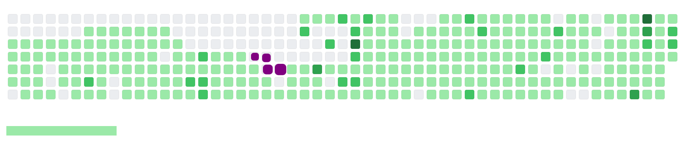
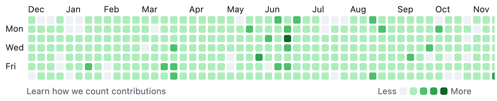
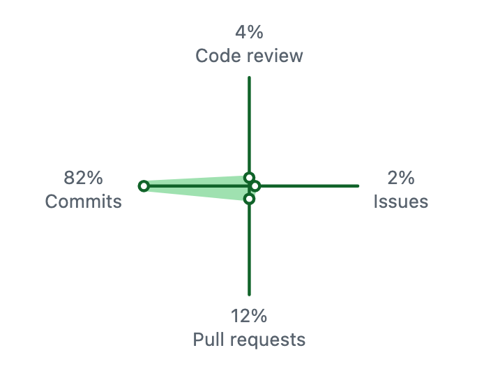

click and drag on gantt clicks into action. only click and release should click in, click and drag should not.
are the dates persisted on drag?
actions / meetings should be able top be assigned to projects, with dependencies
actions added to report should show the full detail of the actions
clicking back on action should take you back to kanban / gantt - whatveer was previous
can / should we better colour code the gantt chart? projects/ status
can we track delays and early start / finish etc?
can / should we have some way to measure proress on actions? percent, or points, or status? action states need expanding
extend admin for more user and usage metrics
admin access to grafana & prometheus? & sentry? & onboarding?

analysis q's arent persisted

update the live mcp prompt (fix.md):
dev server is running via docker only. stop if inaccessible

what are the core ux flows:
dashboard:
meeting
actions
data analysis << rename to insight?

note how long things take to happen, look for slow, failure, repeats etc...

dashboard completion trend should not be a bar chart, but more like github heatmap:

meetings run (dark), completed, tasks started, planned in (light) - somehting like that?

and maybe like:
meetings, actions completed, data analysed, mentor sessions...?

how do we automate the plan > build flow loop? hooks?

do we need pragmatist/realist expert? how do recommendations translate into real world?

insights need to be translated into something a bit better

insights can be answered again (or edited / updated) so that new meetings have up to date context

how to prevent errors in prod :
[vite] connecting... client:733:9
[vite] connected. client:827:12
[AppLayout] Checking authentication... debug.ts:4:13
[Auth] Initializing auth... debug.ts:4:13
[Auth] Checking if session exists... debug.ts:4:13
[Auth] Session exists: true debug.ts:4:13
[Auth] Fetching user info from /api/auth/me... debug.ts:4:13
[Auth] /api/auth/me response status: 200 debug.ts:4:13
[Auth] User data:
Object { id: "c04ea5f4-e6f0-460c-bb48-66cdf6245bb4", user_id: "c04ea5f4-e6f0-460c-bb48-66cdf6245bb4", email: "si@boardof.one", auth_provider: "google", subscription_tier: "free", is_admin: true, session_handle: "ab58f8d2-8c0d-47d2-a6d4-778715b21537" }
debug.ts:4:13
[AppLayout] Auth check complete. Authenticated: true debug.ts:4:13
[Auth] Authentication successful! debug.ts:4:13
XHRGET
http://localhost:8000/api/v1/datasets
[HTTP/1.1 404 Not Found 4ms]

XHRGET
http://localhost:8000/api/v1/auth/google/sheets/status
[HTTP/1.1 404 Not Found 4ms]

Data fetch failed: ApiClientError: Resource not found: 0
ApiClientError client.ts:396
fetch client.ts:439
getDatasets client.ts:1060
datasetsData +page.svelte:12
fetch useDataFetch.svelte.ts:80
\_page +page.svelte:32
untrack runtime.js:704
onMount index-client.js:100
update_reaction runtime.js:256
update_effect runtime.js:431
flush_queued_effects batch.js:705
process batch.js:194
flush_effects batch.js:648
flush batch.js:343
ensure batch.js:524
run_all utils.js:45
run_micro_tasks task.js:10
queue_micro_task task.js:28
queue_micro_task task.js:19
enqueue batch.js:534
ensure batch.js:518
internal_set sources.js:186
set sources.js:165
unsubscribe +layout.svelte:60
set2 index.js:57
initAuth auth.ts:96
\_layout +layout.svelte:23
untrack runtime.js:704
onMount index-client.js:100
update_reaction runtime.js:256
update_effect runtime.js:431
flush_queued_effects batch.js:705
process batch.js:194
flush_effects batch.js:648
flush batch.js:343
ensure batch.js:524
run_all utils.js:45
run_micro_tasks task.js:10
flush_tasks task.js:40
flushSync batch.js:585
Svelte4Component legacy-client.js:127
<anonymous> legacy-client.js:54
initialize client.js:587
\_hydrate client.js:2855
start client.js:361
async* datasets:6360
promise callback* datasets:6359
useDataFetch.svelte.ts:18:12
Failed to check sheets connection: ApiClientError: Not Found
ApiClientError client.ts:396
fetch client.ts:439
getSheetsConnectionStatus client.ts:1248
checkSheetsConnection +page.svelte:39
\_page +page.svelte:33
untrack runtime.js:704
onMount index-client.js:100
update_reaction runtime.js:256
update_effect runtime.js:431
flush_queued_effects batch.js:705
process batch.js:194
flush_effects batch.js:648
flush batch.js:343
ensure batch.js:524
run_all utils.js:45
run_micro_tasks task.js:10
queue_micro_task task.js:28
queue_micro_task task.js:19
enqueue batch.js:534
ensure batch.js:518
internal_set sources.js:186
set sources.js:165
unsubscribe +layout.svelte:60
set2 index.js:57
initAuth auth.ts:96
\_layout +layout.svelte:23
untrack runtime.js:704
onMount index-client.js:100
update_reaction runtime.js:256
update_effect runtime.js:431
flush_queued_effects batch.js:705
process batch.js:194
flush_effects batch.js:648
flush batch.js:343
ensure batch.js:524
run_all utils.js:45
run_micro_tasks task.js:10
flush_tasks task.js:40
flushSync batch.js:585
Svelte4Component legacy-client.js:127
<anonymous> legacy-client.js:54
initialize client.js:587
\_hydrate client.js:2855
start client.js:361
async* datasets:6360
promise callback* datasets:6359
+page.svelte:164:12
