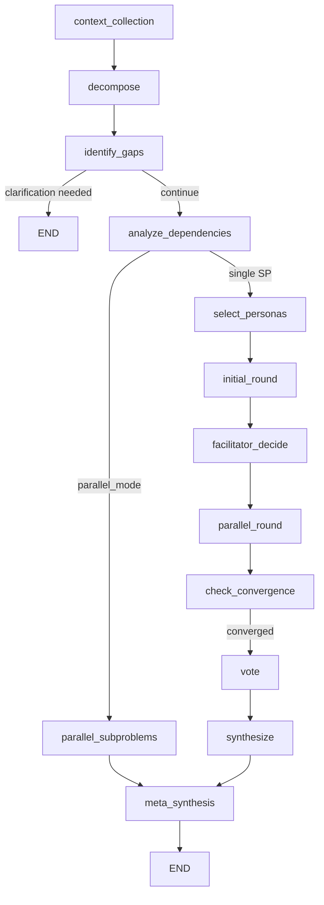

# ADR 005: Parallel Sub-Problems Graph Topology

**Status:** Implemented (feature flag removed 2026-01-03)
**Date:** 2025-12-30
**Updated:** 2026-01-03
**Authors:** Bo1 Team

## Context

Bo1 decomposes complex problems into sub-problems, each deliberated by expert personas. With 2-5 sub-problems running 3-4 rounds each, sequential execution takes 10-15 minutes. Parallel sub-problem execution reduces meeting time by 50-70%.

The feature was initially behind a feature flag (`ENABLE_PARALLEL_SUBPROBLEMS`) during development and stabilization. As of 2026-01-03, the feature flag has been removed and parallel execution with dependency analysis is always enabled for multi-sub-problem deliberations.

## Decision

### Current Behavior (Post-Flag Removal)

- **Single sub-problem**: Uses sequential execution path (`select_personas` → deliberation loop)
- **Multiple sub-problems**: Always uses dependency analysis and parallel execution

Related flags still active:
- `ENABLE_SPECULATIVE_PARALLELISM`: Early context sharing for dependent sub-problems (default: true)
- `USE_SUBGRAPH_DELIBERATION`: LangGraph subgraph for event streaming (experimental)

### Graph Topology (Current)



**Additional Nodes:**
- `analyze_dependencies`: Topological sort of sub-problems into execution batches
- `parallel_subproblems`: Concurrent execution of independent sub-problems

**Node Flow:**
1. `context_collection` → `decompose` → `identify_gaps` → `analyze_dependencies`
2. `analyze_dependencies` creates execution batches respecting dependencies
3. `parallel_subproblems` spawns `_deliberate_subproblem()` for each batch
4. `meta_synthesis` combines results

**Event Emission Gap:**
```
Graph Execution
  └─> EventCollector wraps graph.astream_events()
      └─> Enters parallel_subproblems_node
          └─> Spawns _deliberate_subproblem() tasks
              └─> Direct LLM calls (NO event emission) ✗
              └─> Internal state updates (NOT published) ✗
              └─> Only emits subproblem_complete at end
```

**Workaround: EventBridge Pattern** (documented in `docs/PARALLEL_SUBPROBLEMS_EVENT_EMISSION_FIX.md`)
- `_deliberate_subproblem()` receives optional `EventBridge` instance
- EventBridge publishes events directly to Redis, bypassing EventCollector
- Events include `sub_problem_index` for frontend routing

**Pros:**
- 50-70% time reduction for multi-sub-problem meetings
- Speculative parallelization: dependent SPs can start at round 2

**Cons:**
- Event emission gaps during deliberation (appears "stuck")
- Complex checkpointing across concurrent tasks
- Two code paths to maintain

## Decision Drivers

1. **Proven Stability**: Feature has been stable in production with flag enabled
2. **Code Simplification**: Removing conditional paths reduces maintenance burden
3. **Performance Default**: Users now get 50-70% time savings by default

## Consequences

### Positive
- Single code path simplifies maintenance
- All multi-sub-problem deliberations benefit from parallelization
- Reduced cognitive load for developers

### Negative
- No easy rollback without code change (was: env var toggle)
- Must ensure dependency analysis handles all edge cases

### Operational
- Monitoring for parallel mode:
  - Stuck detection if sub-problems don't complete
  - Batch execution metrics
  - Event emission latency

## Implementation

- **Graph Construction**: `bo1/graph/config.py`
- **Dependency Analysis**: `bo1/graph/nodes/subproblems.py:analyze_dependencies_node`
- **Parallel Execution**: `bo1/graph/nodes/subproblems.py:parallel_subproblems_node`
- **EventBridge Design**: `docs/PARALLEL_SUBPROBLEMS_EVENT_EMISSION_FIX.md`

## History

- **2025-12-30**: ADR created with `ENABLE_PARALLEL_SUBPROBLEMS` feature flag
- **2026-01-03**: Feature flag removed - parallel execution now default for multi-sub-problem cases

## References

- [LangGraph Subgraphs](https://langchain-ai.github.io/langgraph/concepts/low_level/#subgraphs)
- [Topological Sort for DAG Execution](https://en.wikipedia.org/wiki/Topological_sorting)
- Internal: `docs/analysis/subproblem-parallelization.md`
