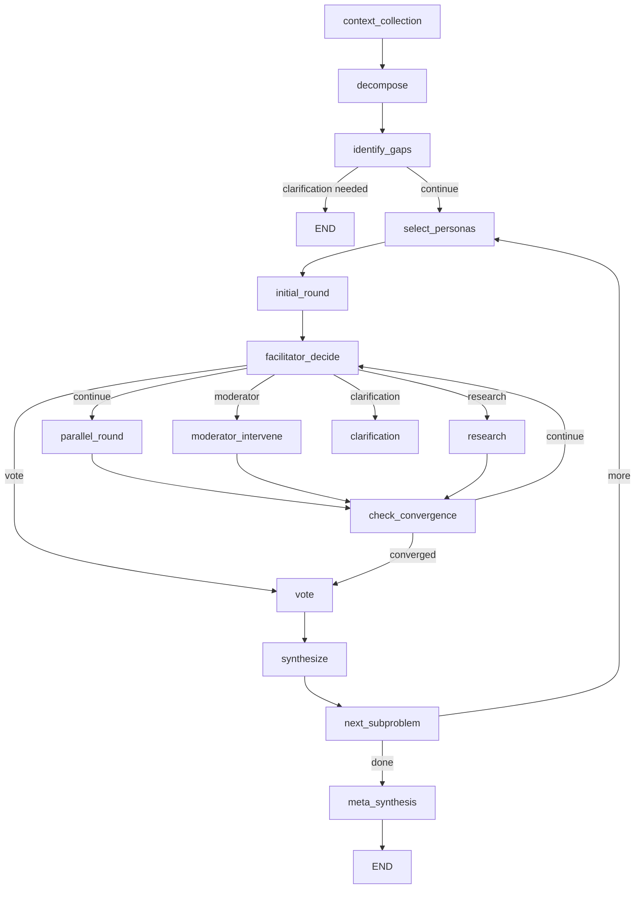
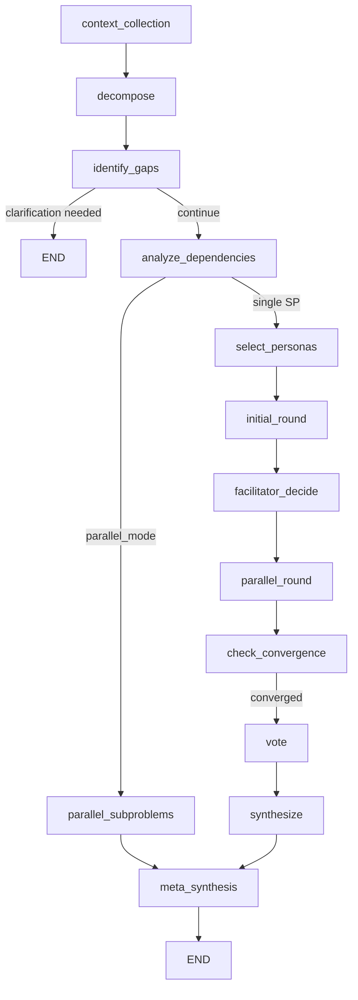

# ADR 005: Parallel Sub-Problems Feature Flag and Graph Topology

**Status:** Accepted
**Date:** 2025-12-30
**Authors:** Bo1 Team

## Context

Bo1 decomposes complex problems into sub-problems, each deliberated by expert personas. With 2-5 sub-problems running 3-4 rounds each, sequential execution takes 10-15 minutes. This motivated adding parallel sub-problem execution to reduce meeting time by 50-70%.

However, parallel execution introduces complexity:
- Different graph topology with additional nodes
- Event emission gaps (parallel tasks bypass LangGraph event system)
- Complex checkpointing for recovery mid-execution
- Dependency analysis for safe parallelization

This ADR documents the `ENABLE_PARALLEL_SUBPROBLEMS` feature flag, its impact on graph topology, and trade-offs between the two execution modes.

## Decision

### Feature Flag Configuration

```python
# bo1/feature_flags/features.py
ENABLE_PARALLEL_SUBPROBLEMS = _parse_bool(
    os.getenv("ENABLE_PARALLEL_SUBPROBLEMS"), default=False
)
```

**Default: OFF** - Sequential mode is the default for production stability.

Related flags:
- `ENABLE_SPECULATIVE_PARALLELISM`: Early context sharing for dependent sub-problems (requires parallel enabled)
- `USE_SUBGRAPH_DELIBERATION`: LangGraph subgraph for event streaming (experimental)

### Sequential Mode (Default: ENABLE_PARALLEL_SUBPROBLEMS=false)



**Node Flow:**
1. `context_collection` → `decompose` → `identify_gaps`
2. For each sub-problem sequentially:
   - `select_personas` → `initial_round` → deliberation loop → `vote` → `synthesize`
   - `next_subproblem` advances to next SP or routes to meta-synthesis
3. `meta_synthesis` combines all sub-problem syntheses

**Pros:**
- Full real-time UI updates via LangGraph event system
- Checkpointing at every node boundary
- Simpler debugging and recovery
- EventCollector intercepts all node completions

**Cons:**
- Sequential execution: 3-5 min per sub-problem
- Total meeting time: 10-15 min for complex problems

### Parallel Mode (ENABLE_PARALLEL_SUBPROBLEMS=true)



**Additional Nodes:**
- `analyze_dependencies`: Topological sort of sub-problems into execution batches
- `parallel_subproblems`: Concurrent execution of independent sub-problems

**Node Flow:**
1. `context_collection` → `decompose` → `identify_gaps` → `analyze_dependencies`
2. `analyze_dependencies` creates execution batches respecting dependencies
3. `parallel_subproblems` spawns `_deliberate_subproblem()` for each batch
4. `meta_synthesis` combines results

**Event Emission Gap:**
```
Graph Execution
  └─> EventCollector wraps graph.astream_events()
      └─> Enters parallel_subproblems_node
          └─> Spawns _deliberate_subproblem() tasks
              └─> Direct LLM calls (NO event emission) ✗
              └─> Internal state updates (NOT published) ✗
              └─> Only emits subproblem_complete at end
```

**Workaround: EventBridge Pattern** (documented in `docs/PARALLEL_SUBPROBLEMS_EVENT_EMISSION_FIX.md`)
- `_deliberate_subproblem()` receives optional `EventBridge` instance
- EventBridge publishes events directly to Redis, bypassing EventCollector
- Events include `sub_problem_index` for frontend routing

**Pros:**
- 50-70% time reduction for multi-sub-problem meetings
- Speculative parallelization: dependent SPs can start at round 2

**Cons:**
- Event emission gaps during deliberation (appears "stuck")
- Complex checkpointing across concurrent tasks
- Two code paths to maintain

## Decision Drivers

1. **Risk Mitigation**: Feature flag allows gradual rollout without deploy
2. **Default Off**: Event emission issues make UX poor until EventBridge complete
3. **Enable Conditions**:
   - EventBridge implementation complete
   - Checkpointing verified for parallel recovery
   - Frontend handles `sub_problem_index` routing
4. **Rollback**: Simple env var toggle, no migration needed

## Consequences

### Positive
- Configurable at runtime per environment
- Backwards compatible with existing sessions
- Enables A/B testing of execution modes
- No schema changes required

### Negative
- Two code paths to maintain in `bo1/graph/config.py`
- Conditional graph construction adds complexity
- EventBridge is additional infrastructure

### Operational
- Monitoring needed for parallel mode:
  - Stuck detection if sub-problems don't complete
  - Batch execution metrics
  - Event emission latency

## Implementation

- **Feature Flag**: `bo1/feature_flags/features.py:78`
- **Graph Construction**: `bo1/graph/config.py:69-204`
- **Dependency Analysis**: `bo1/graph/nodes/subproblems.py:analyze_dependencies_node`
- **Parallel Execution**: `bo1/graph/nodes/subproblems.py:parallel_subproblems_node`
- **EventBridge Design**: `docs/PARALLEL_SUBPROBLEMS_EVENT_EMISSION_FIX.md`

## References

- [LangGraph Subgraphs](https://langchain-ai.github.io/langgraph/concepts/low_level/#subgraphs)
- [Topological Sort for DAG Execution](https://en.wikipedia.org/wiki/Topological_sorting)
- Internal: `docs/analysis/subproblem-parallelization.md`
