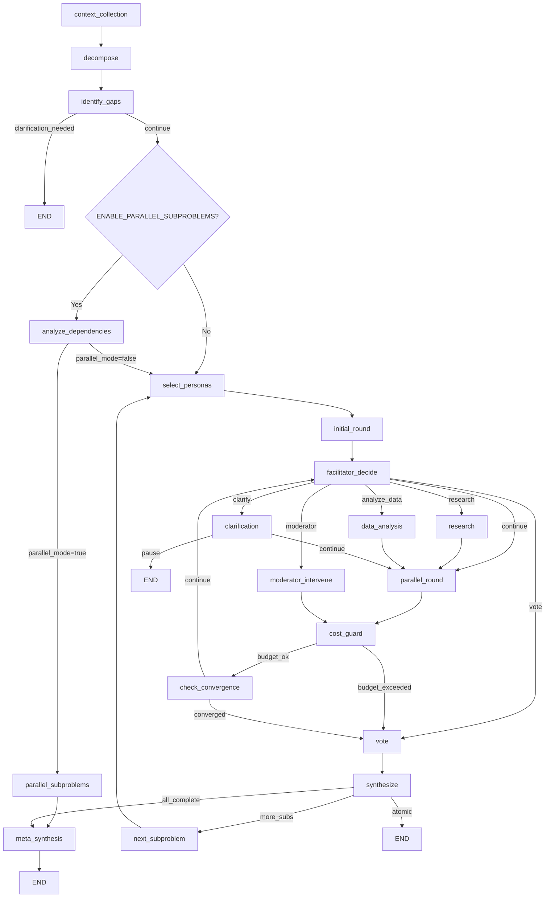
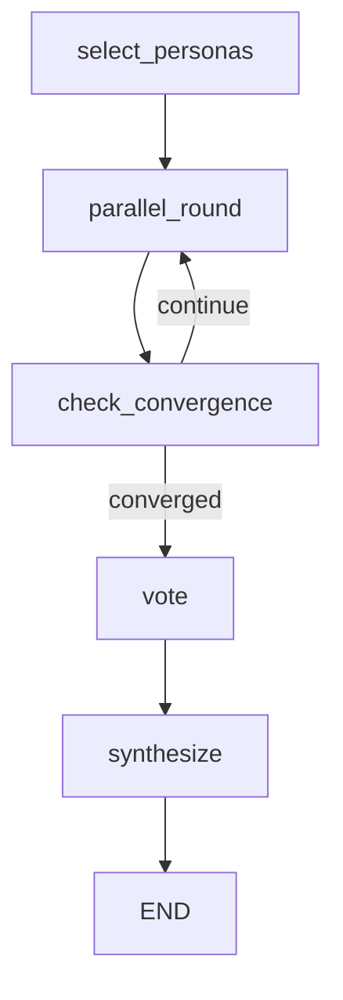

# Sub-problem Parallelization Analysis

**Date:** 2025-12-23
**Status:** Analysis Complete
**Task:** [PERF][P3] Analyze graph topology for independent sub-problem parallelization opportunities

---

## Executive Summary

The Bo1 deliberation graph already implements sophisticated parallelization at two levels:
1. **Expert-level parallelization** (within rounds) - fully implemented
2. **Sub-problem-level parallelization** (across sub-problems) - implemented with batch + speculative modes

This analysis identifies **no major new parallelization opportunities** at the sub-problem level, as the current implementation is comprehensive. However, we document the topology and recommend minor optimizations.

---

## Current Graph Topology

### Main Graph (Sequential Phase Flow)



### Subgraph (Per Sub-problem Deliberation)



---

## Node Classification by Isolation Level

### Fully Isolated Nodes (Can Run Independently Per Sub-problem)

| Node | Reads | Writes | Dependencies |
|------|-------|--------|--------------|
| `select_personas_sp_node` | sub_problem, parent_problem | personas | None |
| `parallel_round_sp_node` | contributions, personas | contributions | Previous round |
| `check_convergence_sp_node` | metrics, round_number | should_stop | None |
| `vote_sp_node` | contributions, personas | votes | All rounds complete |
| `synthesize_sp_node` | votes, contributions | synthesis | Voting complete |

**Key Finding:** All deliberation nodes operate on sub-problem-scoped state. There are no cross-sub-problem data dependencies within the deliberation loop itself.

### Aggregate Nodes (Require All Sub-problems)

| Node | Requires |
|------|----------|
| `meta_synthesize_node` | All `SubProblemResult` objects |
| `route_after_synthesis` | Checks completion count |

### Shared State Nodes (Global Context)

| Node | Shared Resource |
|------|-----------------|
| `context_collection_node` | User business context (read once) |
| `decompose_node` | Problem.sub_problems (defines parallelization) |
| `research_node` | Brave/Tavily API (rate-limited) |
| `data_analysis_node` | Dataset storage (DO Spaces) |

---

## Current Parallelization Implementation

### Level 1: Expert-Level Parallelization (Implemented ✅)

**Location:** `bo1/graph/nodes/rounds.py:_generate_parallel_contributions()`

- All 3-5 experts contribute **in parallel** within each round
- Uses `asyncio.gather()` for concurrent LLM calls
- Latency: **O(1 × LLM_latency)** instead of **O(N × LLM_latency)**
- Estimated savings: **60-80%** per round

```python
# Current implementation (simplified)
tasks = [engine._call_persona_async(expert) for expert in experts]
results = await asyncio.gather(*tasks)
```

### Level 2: Sub-problem Batch Parallelization (Implemented ✅)

**Location:** `bo1/graph/nodes/subproblems.py:_execute_batch()`

- Independent sub-problems execute **in parallel** within batches
- Batches respect dependencies (topological sort)
- Uses `asyncio.gather()` for concurrent subgraph invocations

```python
# Current implementation (simplified)
for batch in execution_batches:
    batch_tasks = [_run_single_subproblem(sp_idx) for sp_idx in batch]
    results = await asyncio.gather(*batch_tasks)
```

### Level 3: Speculative Parallelization (Implemented ✅)

**Location:** `bo1/graph/nodes/subproblems.py:_execute_speculative_parallel()`

- **All** sub-problems start concurrently
- Dependent sub-problems wait for dependencies to reach **early start threshold** (round 2)
- Uses `PartialContextProvider` for cross-sub-problem context sharing

**Benefits:**
- 40-60% latency reduction on dependency chains
- Early context injection instead of waiting for full completion

```
Traditional: [SP0 completes] → [SP1 completes] → [SP2 completes] = ~10 min
Speculative: [SP0 starts] → [SP0 R2, SP1 starts] → [...] = ~5 min
```

---

## Parallelization Opportunities Analysis

### Opportunity 1: Expert Summarization (Already Parallelized)

**Location:** `bo1/graph/nodes/synthesis.py:next_subproblem_node()`

**Status:** ✅ Already parallelized (P2 batch fix)

```python
# Already implemented
results = await asyncio.gather(
    *[summarize_expert(p) for p in personas],
    return_exceptions=True,
)
```

### Opportunity 2: Quality Checks During Round (Already Parallelized)

**Location:** `bo1/graph/nodes/rounds.py:parallel_round_node()`

**Status:** ✅ Quality checks run concurrently with contribution generation

### Opportunity 3: Research + Contribution Generation

**Current:** Sequential (research → round)
**Potential:** Could pipeline research results mid-round

**Analysis:** Not recommended because:
1. Research results inform contribution content
2. Would require partial-round handling
3. Complexity outweighs benefit (research only on facilitator trigger)

### Opportunity 4: Cross-Sub-problem Expert Memory Pre-computation

**Current:** Expert summaries generated after each sub-problem
**Potential:** Pre-generate templates during previous sub-problem's convergence phase

**Analysis:** Marginal benefit (~200ms savings)
- Expert summaries are lightweight (75 tokens)
- Already parallelized within next_subproblem_node
- Would add complexity for minimal gain

---

## Constraints on Further Parallelization

### 1. API Rate Limits

| Provider | Limit | Impact |
|----------|-------|--------|
| Anthropic | Variable (tier-based) | Throttles at ~50 concurrent |
| OpenAI | Variable (tier-based) | Throttles at ~60 concurrent |
| Voyage AI | 300 RPM | Embedding bottleneck |
| Brave Search | 1 QPS | Hard limit on research |

**Current mitigation:** Circuit breakers (`bo1/utils/circuit_breaker.py`)

### 2. Memory Pressure

- Each sub-problem subgraph maintains independent state
- With 5 concurrent sub-problems × 6 rounds × 5 experts = **150 in-flight operations**
- Redis checkpoint size grows with concurrency

**Current mitigation:** Contribution pruning (`prune_contributions_for_phase()`)

### 3. Event Stream Ordering

- SSE events must maintain causal ordering per sub-problem
- Interleaved events across sub-problems handled by `sub_problem_index` field
- Frontend uses index for event routing

### 4. Cost Budget Enforcement

- `cost_guard_node` checks per-round, not per-sub-problem
- Speculative execution could exceed budget before detection

**Recommendation:** Add sub-problem-level cost guard (not implemented)

---

## Recommendations

### Recommendation 1: No Major Changes Needed ✅

The current implementation already achieves near-optimal parallelization:
- Expert-level: Fully parallel
- Sub-problem level: Batch + speculative modes available
- Cross-sub-problem: Early start with partial context

### Recommendation 2: Add Sub-problem Cost Guard (P4)

**Effort:** Low (~4 hours)
**Impact:** Prevents runaway costs in speculative mode

```python
# In _run_subproblem_speculative
if cumulative_cost > SUBPROBLEM_BUDGET:
    emit_warning("subproblem_budget_exceeded")
```

### Recommendation 3: Monitor Speculative Mode Savings (P4)

**Effort:** Low (~2 hours)
**Impact:** Data for optimization decisions

Add Prometheus metrics:
- `speculative_execution_time_saved_seconds{session_id}`
- `speculative_early_start_count{session_id}`

### Recommendation 4: Consider Embedding Pre-fetch (P5)

**Effort:** Medium (~8 hours)
**Impact:** Minor latency reduction in semantic dedup

Pre-compute embeddings during round N-1 for dedup in round N.

---

## Quantified Impact Summary

| Optimization | Status | Latency Reduction | Cost Impact |
|--------------|--------|-------------------|-------------|
| Expert parallelization | ✅ Implemented | 60-80% per round | Neutral |
| Batch parallelization | ✅ Implemented | 50-70% overall | Neutral |
| Speculative execution | ✅ Implemented | 40-60% on chains | +5-10% (early starts) |
| Expert summaries | ✅ Implemented | ~500ms per SP | Neutral |
| Sub-problem cost guard | ❌ Not implemented | N/A | -5-10% (early stop) |

---

## Appendix: Key Files

| File | Purpose |
|------|---------|
| `bo1/graph/config.py` | Main graph construction |
| `bo1/graph/nodes/subproblems.py` | Sub-problem parallelization |
| `bo1/graph/nodes/rounds.py` | Expert parallelization |
| `bo1/graph/deliberation/partial_context.py` | Speculative context sharing |
| `bo1/graph/deliberation/subgraph/config.py` | Sub-problem subgraph |
| `bo1/graph/state.py` | State isolation boundaries |
